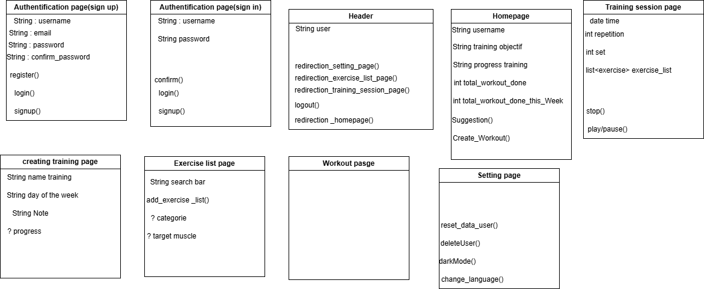

# Project Structure
## Frontend

## Backend

### Backend system structure

| Module  |  Controller |  Service(s) | Repository/ ORM  |
|---|---|---|---|
|training.module   |UserExercise.Controller, Exercise.Controller   | UserExercise.service, Exercise.service |UserExercise, Exercise  |
| workout.module  | Workout.Controller  | Workout.service  |  Workout |   |
|  user.module | user.Controller  |  user.service | User  |
|   |   |   |   |   |

## Routes:

|Method|Route|Input(Body/Query/Params)|Description|
|--|--|--|--|
|GET|/workout| **Body**: {workout name(named by the user)}|z|
|POST|/workout| **Body**: {list of training}|z|
|Inputs|/workout|  |z|
|POST|/excerice|exercise name, targeted muscle, , |y|
|POST|/UserExercise|repetition/time, set, weight|y|
|POST|/user|name|y|

### /Workout

### Get

Returns the "Workouts" associated with the user

#### Inputs

- login token

#### Output

the workouts associated with the user

### Post

Creates a new workout associated with the user

#### Inputs

- the logged-in user
- the User object: (Name, Password, etc.)

#### Output

Returns the response to the action

### Put/Patch

modifies a workout whose ID is x and which is associated with the user.

#### Inputs

- the logged-in user
- the ID of the user to modify
- the attributes to modify

#### Output

Returns the response to the action

## /UserExercise (My Exercise)

### Get

Returns the "UserExercise" associated with the user

#### Input

- the logged-in user

#### Output

List of "UserExercise" associated with the user

### Post

Creates a new "UserExercise" associated with the user

#### Input

- The logged-in user
- The "UserExercise" object to create

#### Output

Returns the response to the action

### Put/Patch

Modifies a "UserExercise" whose ID is associated with the user.

#### Input

- The logged-in user
- The UserExercise ID
- The UserExercise object to modify

#### Output

Returns the response to the action

## /Exercise

### Get

Returns the exercises

#### Input

- (Optional) "Query" for filtering

#### Output

List of filtered exercises

### Post

Submit a creation request for validation

#### Input

- ID of the user creating the exercise
- Object of the exercise to be created

#### Output

Returns the response to the action

