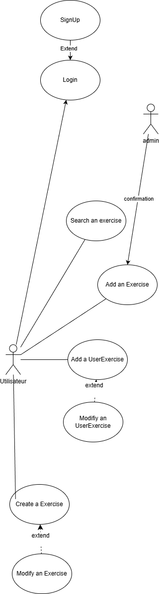

# Descripción General del Proyecto

## Una descripción clara de la aplicación

El software te permite crear un servidor que gestiona datos de usuario para una aplicación de entrenamiento. Permite la sincronización de entrenamientos en múltiples interfaces de usuario disponibles en varias plataformas. Esta aplicación permitirá a los usuarios realizar un seguimiento fácil de su progreso, saber qué ejercicio hacer según sus necesidades y cómo realizarlo correctamente, además de obtener inspiración.

## El planteamiento del problema y los objetivos (marco)

Esta aplicación resuelve el problema de sincronizar entrenamientos en múltiples plataformas en una interfaz de usuario diseñada para el entrenamiento.

El objetivo es crear una aplicación autohospedada y de código abierto que sea simple, documentada y exclusivamente para entrenamientos.

## Una visión general de las funcionalidades de la aplicación

- Crear entrenamientos personalizados (el usuario podrá seleccionar ejercicios y luego crear entrenamientos que son listas de ejercicios)
- Seguimiento del progreso (el usuario ingresará el número de repeticiones/tiempo, series y peso).
- Búsqueda de ejercicios con o sin filtros

## Descripción de usuarios y roles

### Desarrolladores

Otros usuarios que deseen participar en la mejora de la aplicación.

### Usuarios

Usuarios que deseen alojar la aplicación.

## Requisitos funcionales y no funcionales

### Funcionales

- Base de datos: usuario, ejercicios, lista de ejercicios creados por el usuario, entrenamiento.
- API REST
- Creación de una sesión de entrenamiento
- Búsquedas de ejercicios
- Seguimiento del progreso
- Validación administrativa

### No funcionales

- Principios SOLID
- Documentación clara

## Restricciones de la aplicación

- Backend: Next.js
- Frontend: Angular

## Casos de uso

### Especificaciones de casos de uso:

#### Buscar un ejercicio:

| Descripción  |  Buscar un ejercicio en la base de datos pública |
|---|---|
|  Actores |  Usuario |

#### Agregar un ejercicio:

| Descripción  | Agregar un ejercicio a la base de datos pública |
|---|---|
|  Actores | Usuario |

#### Agregar progreso del usuario a un ejercicio:

| Descripción  | Agregar progreso del usuario vinculado al usuario, especificando peso, duración, etc. |
|---|---|
|  Actores | Usuario |

#### Modificar progreso del usuario para un ejercicio:

| Descripción  | Modificar progreso del usuario vinculado al usuario, especificando peso, duración, etc. |
|---|---|
|  Actores | Usuario |

#### Crear un entrenamiento:

| Descripción  | Crear un entrenamiento vinculado a un usuario |
|---|---|
|  Actores | Usuario |

#### Modificar un entrenamiento:

| Descripción  | Modificar un entrenamiento vinculado a un usuario |
|---|---|
|  Actores | Usuario |

## Planificación a través de la metodología de desarrollo

La planificación se llevará a cabo semanalmente durante el período del curso, asegurando que se cumplan los objetivos. Además, la metodología de desarrollo será iterativa, lo que permitirá reorganizar el proyecto en caso de problemas.
El proyecto se dividirá en tres trimestres:
- Desarrollo inicial de la API
- Frontend
- Despliegue
