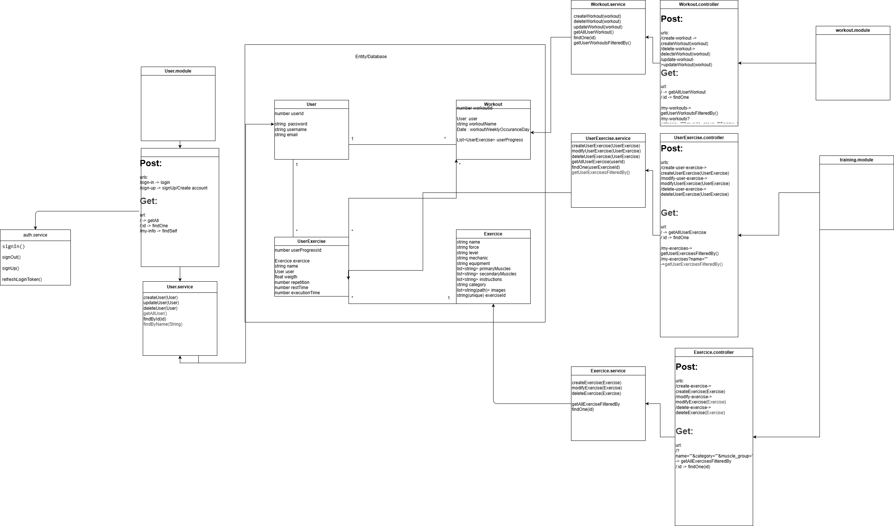

## Backend

- [  ] 3 módulos
- [  ]

### Estructura del sistema backend

| Módulo  |  Controlador |  Servicio(s) | Repositorio/ ORM  |
|---|---|---|---|
|training.module   |Workout.Controller, UserProgress.Controller, Exercise.Controller   |  Workout.service, UserProgress.service, Exercise.service | Workout, UserProgress, Exercise  |
|  user.module | user.Controller  |  user.service | User  |
|   |   |   |   |   |

## Rutas:

|Método|Ruta|Entrada(Body/Query/Params)|Descripción|
|--|--|--|--|
|GET|/workout| **Body**: {workout name(named by the user)}|z|
|POST|/workout| **Body**: {list of training}|z|
|Inputs|/workout|  |z|
|POST|/excerice|exercise name, targeted muscle, , |y|
|POST|/userprogress|repetition/time, set, weight|y|
|POST|/user|name|y|

### /Workout

### Get

Devuelve los "entrenamientos" asociados con el usuario

#### Entradas

- token de inicio de sesión

#### Salida

los entrenamientos asociados con el usuario

### Post

Crea un nuevo entrenamiento asociado con el usuario

#### Entradas

- el usuario con sesión iniciada
- el objeto User: (nombre, contraseña, etc.)

#### Salida

Devuelve la respuesta a la acción

### Put/Patch

modifica un entrenamiento cuyo ID es x y que está asociado con el usuario.

#### Entradas

- el usuario con sesión iniciada
- el ID del usuario a modificar
- los atributos a modificar

#### Salida

Devuelve la respuesta a la acción

## /UserProgress (Mi ejercicio)

### Get

Devuelve el "progreso del usuario" asociado con el usuario

#### Input

- el usuario con sesión iniciada

#### Output

Lista de "progreso del usuario" asociado con el usuario

### Post

Crea un nuevo "progreso del usuario" asociado con el usuario

#### Input

- El usuario con sesión iniciada
- El objeto "progreso del usuario" a crear

#### Output

Devuelve la respuesta a la acción

### Put/Patch

Modifica un "progreso del usuario" cuyo ID está asociado con el usuario.

#### Input

- El usuario con sesión iniciada
- El ID del progreso del usuario
- El objeto de progreso del usuario a modificar

#### Output

Devuelve la respuesta a la acción

## /Exercise

### Get

Devuelve los ejercicios

#### Input

- (Opcional) "Query" para filtrar

#### Salida

Lista de ejercicios filtrados

### Post

Envía una solicitud de creación para validación

#### Entrada

- ID del usuario que crea el ejercicio
- Objeto del ejercicio a crear

#### Salida

Devuelve la respuesta a la acción

## Composite

El patrón composite se utilizará para estructurar nuestras rutas. Por lo tanto, las subrutas estarán contenidas dentro de subcarpetas en una estructura similar a las rutas del api/frontend.

## Singleton

NestJs utiliza singleton por defecto en su repositorio.

## Decorator

Decorator se utilizará para inyectar código dentro de funciones y rutas
para reducir considerablemente la cantidad de código y aumentar la legibilidad del código.
