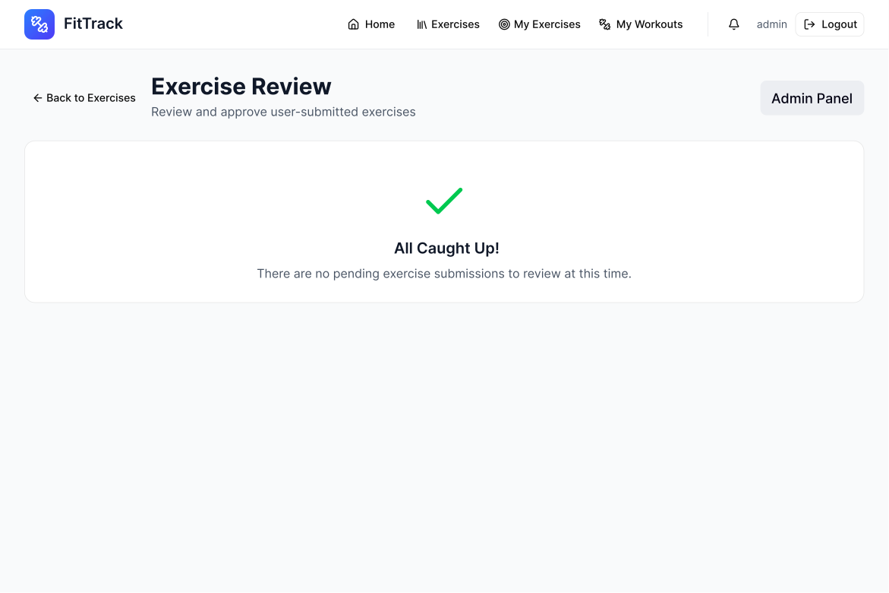
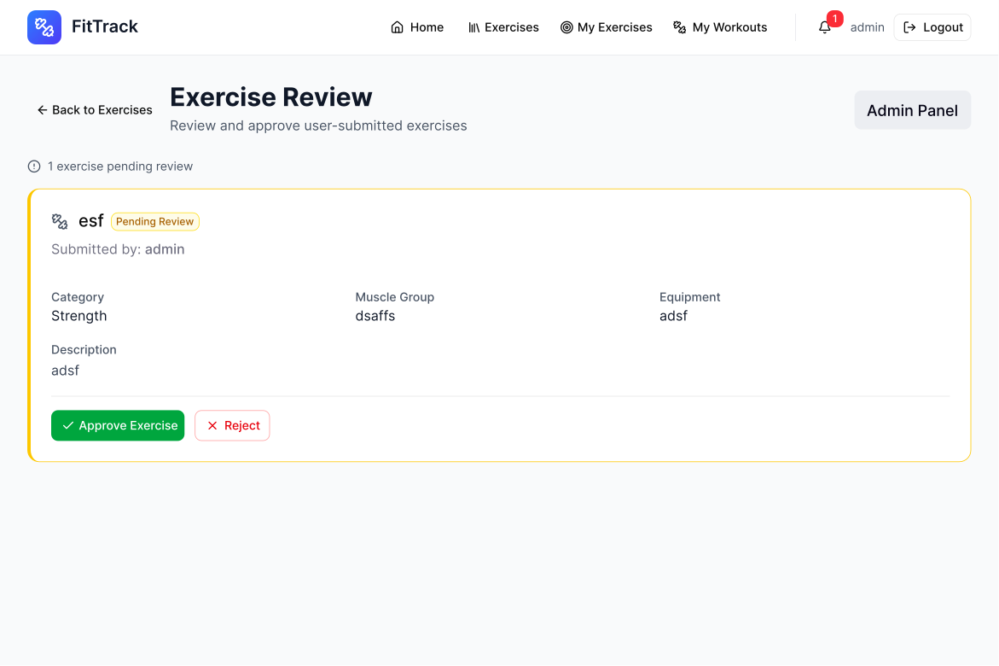

# Designs Front-End

## Page d'accueil :

## Page de connexion :

## Page d'inscription :

## Page d'entraînement :

## Page de création d'entraînement :

# Page d'exercice :

## Page de création d'exercice :

# Révision des exercices (Administrateur uniquement)

## Vide

## un

## Ma page d'exercices :

## Ma page de création d'exercices :

